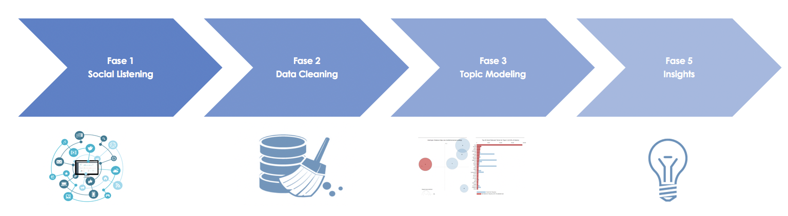
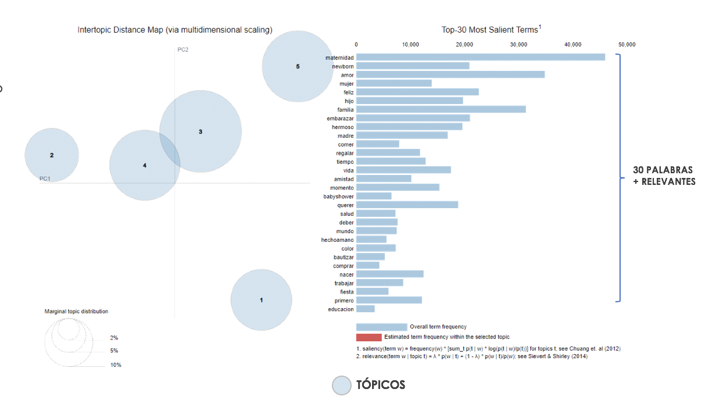

# Topic Modelling

All projects start with an specific problem to solve, in this case the creative area wanted to understand "what is being talked about when we talk about a certain theme?" for example you may want to understand which are the main problems when a Telco's companie is mentioned, the main topics of youtubers conversation or even understand consumer profiles of a certain brand.

So, an interesting technique that allow us to solve this problem is the Latent Dietrich Allocation (LDA). This one cluster the words assigning it a probability of belonging to a topic. Finally, looking at the words contained in each topic you can interpret it adding value to the analysis.

Here's a quick script guide:

- LDA_preproc.py: Cleaning class to preprocess text data before getting into the model. 

- lemmatization-es_add_v2 .txt: This file contains many words that lemmatize Argentinian words. Feel free to add words.
  lemmatization-es_v2.txt	

- lda_topicOpt.R: How can you know which is a good amount of topics? Well, run this code, take a lot of coffees and you will know the answer.

- TopicModeling.py: This code uses the preproc class and generate the clusters.

- wordCloudGenerator.R: If you want to show each topic in wordclouds, run this code.

Here is the workflow in this kind of projects:

And here is an example of how the cluster may be:

